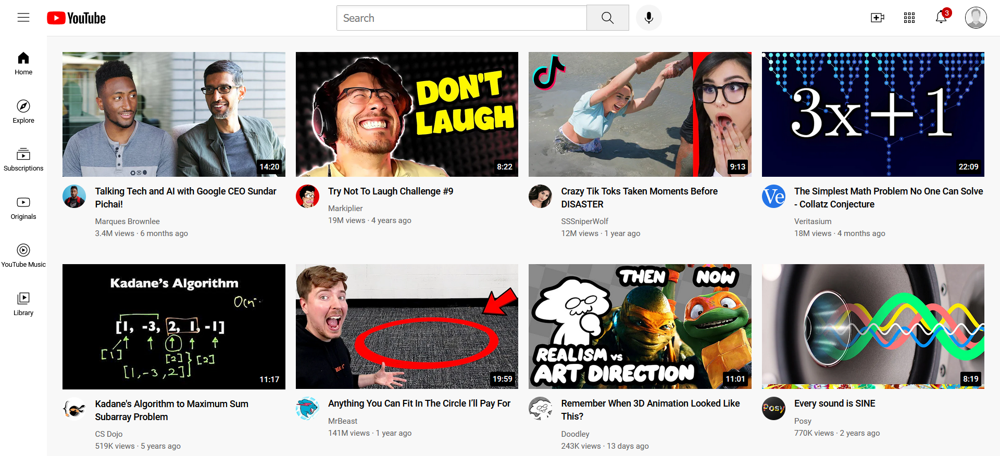

# YouTube Homepage Clone

Welcome to the YouTube Homepage Clone project! This project is a simple HTML and CSS clone of the YouTube homepage. It's a static webpage that emulates the basic appearance and layout of the YouTube homepage.

## Table of Contents

- [Demo](#demo)
- [Features](#features)
- [Getting Started](#getting-started)
- [Contributing](#contributing)
- [License](#license)

## Demo

You can view a live demo of the YouTube Homepage Clone [here](#).

## Features

- Responsive design: The clone is designed to work well on both desktop and mobile devices.
- Static content: It uses only HTML and CSS, with no JavaScript involved.
- Emulated YouTube features: It replicates the key elements of the YouTube homepage, including the header, sidebar, and video previews.

## Getting Started

To get a local copy of this project up and running, follow these steps:

1. Clone the repository.
2. Open the project folder in your favorite code editor.
3. Open the index.html file in your web browser to view the YouTube homepage clone.

That's it! You now have a local copy of the YouTube homepage clone running on your machine.
